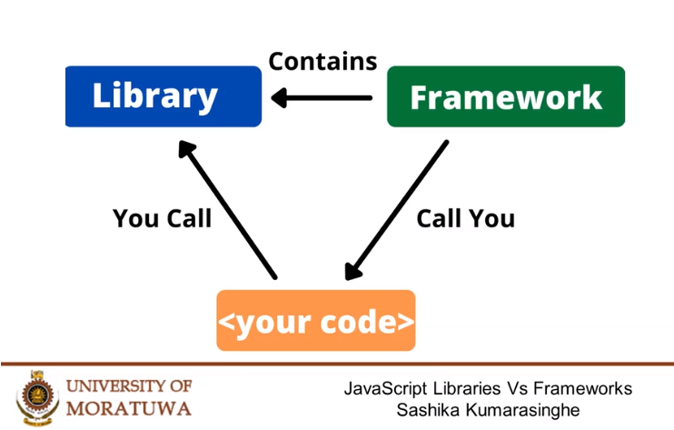
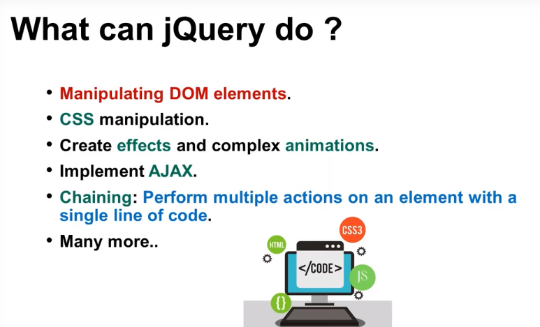
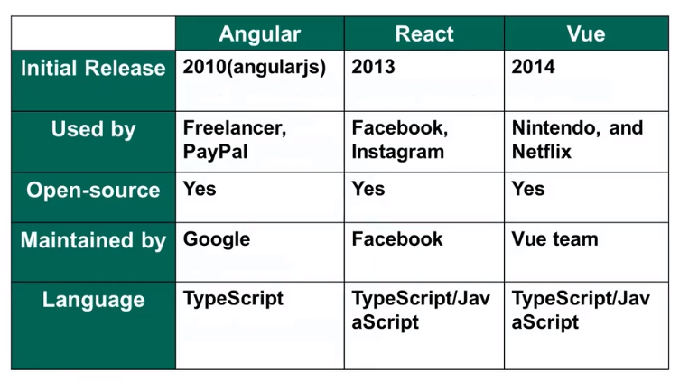
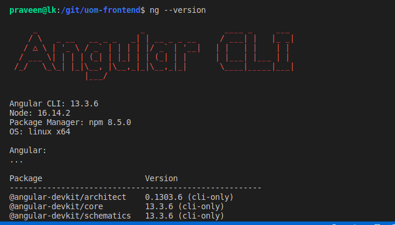
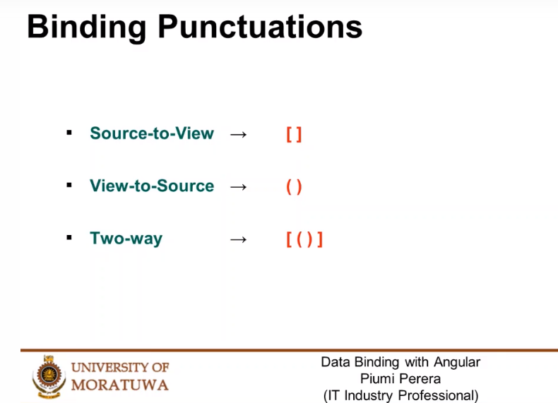
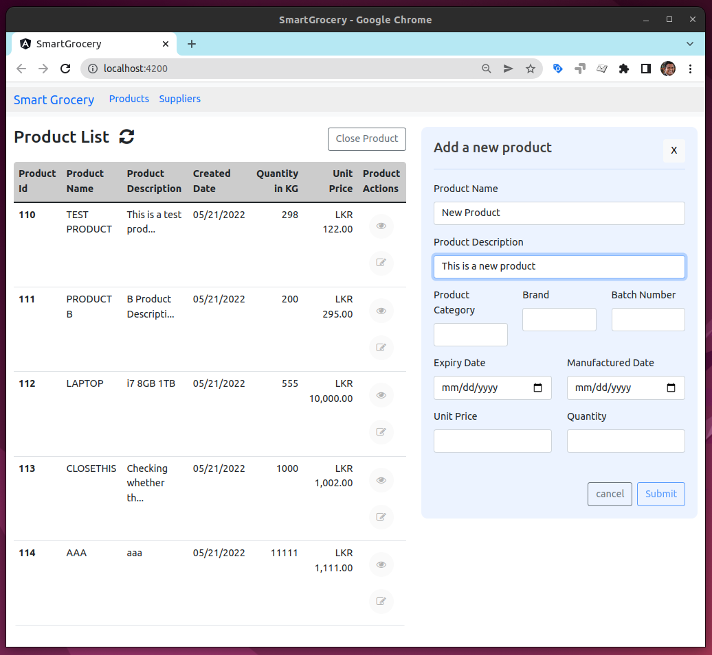
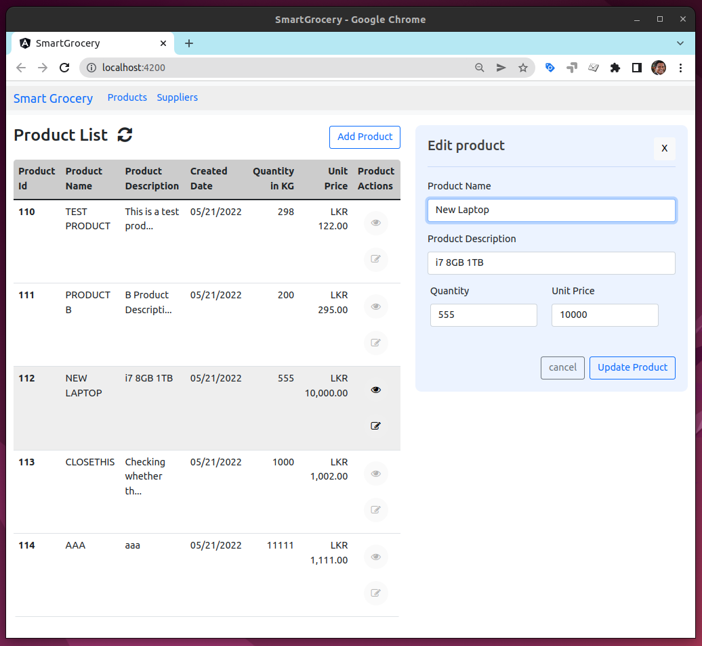
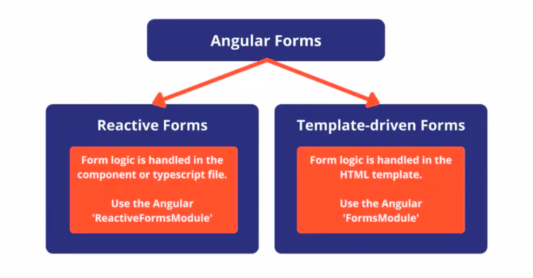

# Course 4 -  Frontend Web Development

## C201 - Python for Beginners (Done)
## C202 - Web Design for Beginners (Done)
## C203 - Python Programming (Done)
## C204 - Front-end Web Development (Current)

Full Stack Developer Specialization - University of Moratuwa

# Libraries and Frameworks

# jQuery

# SPA Frameworks

# Angular

## Data Binding

# Smart Grocery

## Add Product

## Edit Product

# Form Types

